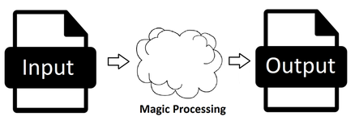

# The Ruby Compiler Toolkit Project

Welcome. This project exists as a result of the conjecture that Ruby would be
an excellent language for writing compilers. This belief is based on the
observation that Ruby excels in handling complex data structures and
relationships in a simple, flexible, easier-to-understand way. Further, the
lack of long compile/link/load development cycles combined with excellent
support for code unit and integration testing make Ruby a highly productive
environment.

Further, while Ruby is considered slow by many, this is less relevant in an
application, like a compiler, where a lot of time is spent reading and writing
files.

As a result, this toolkit is being developed for a number of reasons:

1. To test the Ruby Compiler Conjecture.
2. To build a platform that will permit others to develop compilers of
their own.
3. To demonstrate the principles of compiler design and construction without
all of the obscuring ceremony and boilerplate of more conventional languages.
4. To promote programming education and exploration.

#### Translators:

So, just what are compilers? Well compilers are a member of a family of
programs called translators. Translators are programs that accept an input and
produce an output, equivalent to the input in a different representation.
This can be shown as follows:

There are many classes of translators based on the nature of the input, the
output, and the relationship between them. Let's take a look at the translator
family:

| Program Class | Input Type | Output Type | Relationship
|---|---|---|---|
|Assembler | Low level | Machine code | 1 to 1 |
|Compiler | High level | Lower level | 1 to Many
|Interpreter | High level | Performs actions | 1 to Many
|Transpiler | High level | High level | Many to Many
|Importer | Formatted Data | Data Structure | Many to 1
|Exporter | Data Structure | Formatted Data |  1 to Many

Notes:
* Formatted Data is structured text that includes JSON, XML, HTML, YAML, etc.
* Data Structures are in memory-aggregations of structured data.
* Interpreters and importers are similar in that they both translate for
immediate use. You could say an interpreter imports code and an importer
interprets data.
* Exporters are really formatters not translators, but are shown here for
completeness because they are the converse of importers. On that note one could
also add the disassembler and decompiler, but that would be silly.

As can be seen, translators encompass a very wide variety of applications with
many diverse requirements. They are also crucial in so many aspects of
information processing that it should be no surprise that they are intensely
studied and analyzed.

This diversity also shows why no one approach can ever handle all of these
requirements. In spite of this, we will try to keep as many options open as
possible, even if this means we must compromise. In general, clarity and
simplicity will be favored over complexity and performance.

WIP

## Installation

Add this line to your application's Gemfile:

```ruby
gem 'rctp'
```

And then execute:

    $ bundle

Or install it yourself as:

    $ gem install rctp

## Usage

WIP

## Contributing

#### Plan A

1. Fork it ( https://github.com/PeterCamilleri/rctp/fork )
2. Create your feature branch (`git checkout -b my-new-feature`)
3. Commit your changes (`git commit -am 'Add some feature'`)
4. Push to the branch (`git push origin my-new-feature`)
5. Create a new Pull Request

#### Plan B

Go to the GitHub repository and raise an
 [issue](https://github.com/PeterCamilleri/rctp/issues)
calling attention to some aspect that could use some TLC or a suggestion or an
idea.

## License

The gem is available as open source under the terms of the
[MIT License](./LICENSE.txt).

## Code of Conduct

Everyone interacting in the rctp project’s codebases, issue trackers,
chat rooms and mailing lists is expected to follow the
[code of conduct](./CODE_OF_CONDUCT.md).
